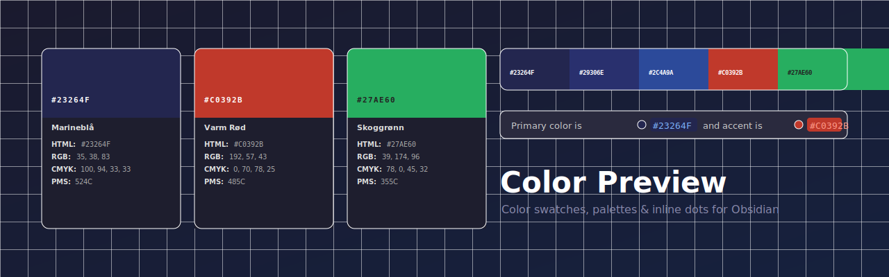

<div align="center">



<br/>

[](https://github.com/stephanteig/obsidian-color-preview/releases/latest)
[](LICENSE)
[](https://obsidian.md)
[](https://obsidian.md)

**Color Preview** turns raw hex codes into beautiful, interactive color cards inside your Obsidian notes — perfect for brand guidelines, design systems, and color documentation.

</div>

---

## Features

- **Color cards** — visual swatch with hex, RGB, CMYK, and PMS displayed below
- **Palette blocks** — display a whole brand palette as a horizontal strip of swatches
- **Inline dot previews** — small color dots appear automatically next to any hex code in your notes
- **Click swatch to edit** — tap any swatch to open the color picker and update the hex in place
- **Click to copy** — tap any value (HTML / RGB / CMYK) to instantly copy it to clipboard
- **Auto-calculated values** — if only a hex is provided, RGB and CMYK are approximated automatically
- **Multiple insertion methods** — ribbon icon, `/color` slash command, paste detection, command palette, and more
- **PDF / DOCX safe** — the underlying markdown stays readable as plain text when exported

---

## Color Card

Write a `color` fenced code block with any combination of fields:

````markdown
```color
name: Marineblå
hex: #23264F
rgb: 35, 38, 83
cmyk: 100, 94, 33, 33
pms: 524C
```
````

> **Only `hex` is required.** If `rgb` or `cmyk` are omitted, approximate values are calculated automatically and shown in italic.

<details>
<summary><strong>Minimal example — hex only</strong></summary>
<br/>

````markdown
```color
hex: #27AE60
```
````

RGB and CMYK are derived from the hex and marked with `~` to indicate they are approximate.

</details>

---

## Palette Block

Show an entire brand palette as a side-by-side strip. Click any swatch to copy its hex.

````markdown
```palette
#23264F Marineblå
#29306E Mellomblå
#2C4A9A Blå
#FFFFFF Hvit
#1A1A1A Kull
```
````

Each line accepts either `#hex name` or `name: #hex` format.

---

## Inline Dot Previews

Hex codes anywhere in your notes automatically get a small color dot — no extra syntax needed.

```markdown
The primary color is `#23264F` and the accent is `#C0392B`.
Plain text works too: background is #F2F2F2.
```

---

## Inserting Colors

| Method | How |
|---|---|
| **Ribbon icon** | Click the palette icon in the left sidebar |
| **`/color`** | Type `/color` in any note for a 4-option dropdown |
| **Paste detection** | Paste a bare `#RRGGBB` → choose *Insert as block* or *Insert as text* |
| **Command: color picker** | `Color Preview: Insert color (color picker)` |
| **Command: type hex** | `Color Preview: Insert color (type hex)` |
| **Command: from clipboard** | `Color Preview: Insert color from clipboard` |
| **Command: empty template** | `Color Preview: Insert empty color block` |
| **Command: convert** | Select old-format color text → `Color Preview: Convert selection to color block` |

---

## Editing Colors

Click any color swatch to open the color picker and update the `hex:` value in the note directly — no manual editing needed. Works in both Live Preview and Reading view.

On mobile, tapping the swatch opens a hex input modal pre-filled with the current color.

---

## Installation

### Community Plugin Browser *(once approved)*

1. Open **Settings → Community plugins**
2. Disable Restricted mode if prompted
3. Click **Browse** and search for **Color Preview**
4. Click **Install** → **Enable**

### Manual

1. Download `main.js`, `manifest.json`, and `styles.css` from the [latest release](../../releases/latest)
2. Copy them into `<vault>/.obsidian/plugins/color-preview/`
3. Reload Obsidian and enable the plugin under **Settings → Community plugins**

---

## Settings

| Setting | Default | Description |
|---|---|---|
| Swatch height | 80px | Height of the color rectangle |
| Max card width | 320px | Maximum width of the color card |
| Show color name | On | Whether to display the `name` field in the card |

---

## Screenshots

> Add screenshots to the `assets/` folder and update the paths below.

| Color cards | Palette block |
|---|---|
|  |  |

| Inline dots | Color picker |
|---|---|
|  |  |

---

## License

[MIT](LICENSE) © Stephan Teig
